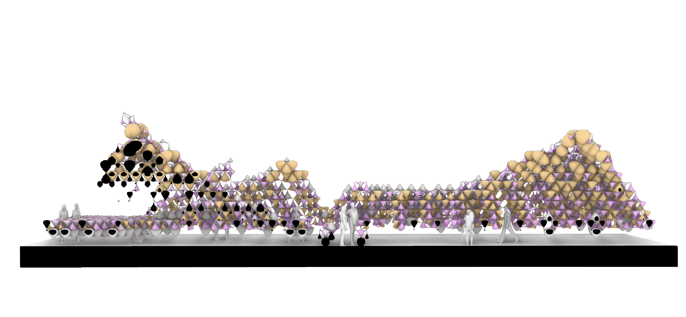
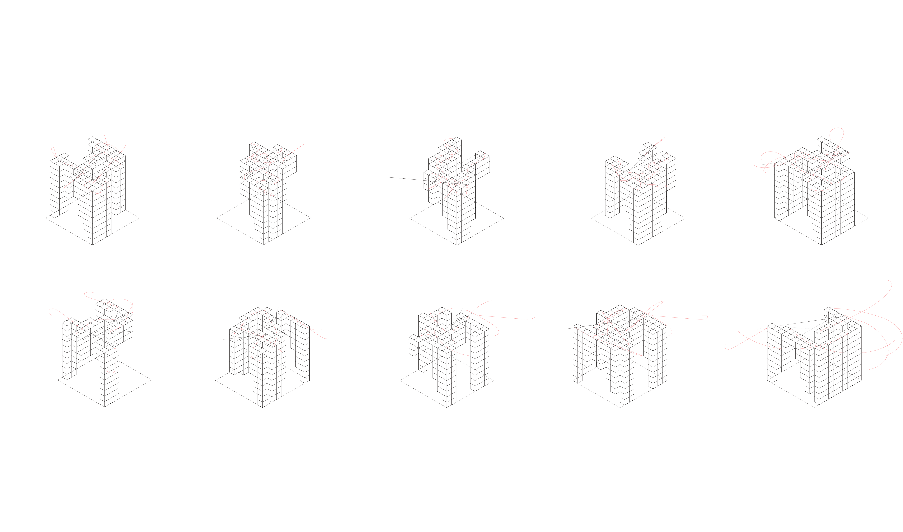
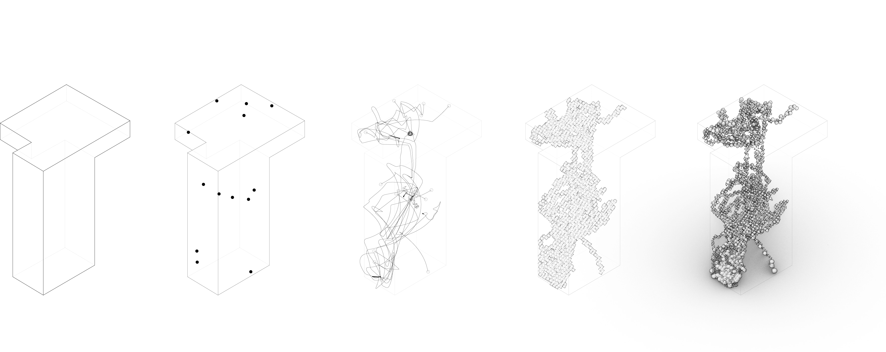
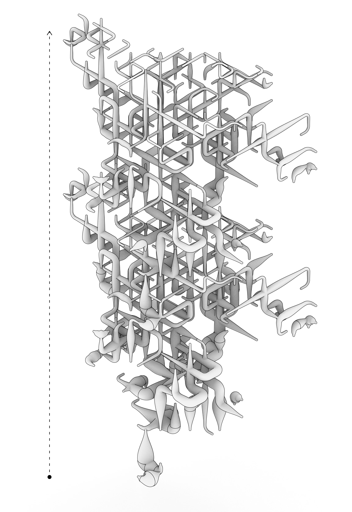

# Software-1-Data-Driven-Immediate-Assembly
This project was driven by the idea of working with inflatable architecture, by creating components shaped by a flexible membrane that holds pressure as well as a set of simple connectors to allow for a full aggregation. 

# Requirements
* Grasshopper 3D Plugin
* [Zebra](https://www.food4rhino.com/app/zebra) - a flocking simulation plug-in

* [Weaverbird](https://www.grasshopper3d.com/group/weaverbird) - topological mesh editor
* [Anemone](https://www.food4rhino.com/app/anemone) - creates loops

# Getting Started
* You can use the .gh file from scripts folder with the following instruction:
  * Define the starting point of the grid
  * Define the boundary of the void

# Workflow
* The following diagram is a visual representation of how the code works, along with a set of detailed explanations of the process

1. create a 3d tetrahedron checkerboard that allows cells to connect at their vertices only
2. using the boundary of the void you are filling, aggregate the generic cells inside
3. generate flocking simulation based on desired anchor points and other criteria such as overhead coverage, luminosity, and part density
4. the path of the flocking selects which sells are kept
5. remaining cells are broken into four groups based on the number of neighbors; this informs the material property of the components
6. identify connection points between cells, removing any cell that has no neighbor, therefore all cells are in loop with the system
7. each group is processed through an inflation simulation that results in varyng inflated cells with a final result for the system

 
 
 

# Credits
**DATA-DRIVEN IMMEDIATE ASSEMBLY // SOFTWARE I** is a project of IAAC, Institute for Advanced Architecture of Catalonia developed at the **Master in Robotics and Advanced Construction** in **2020/2021** by:

Students: **Hendrik Benz, Michael DiCarlo, Aslinur Taskin**

Faculty: **Ján Pernecký**

Faculty Assistant: **Eugenio Bettucchi**
